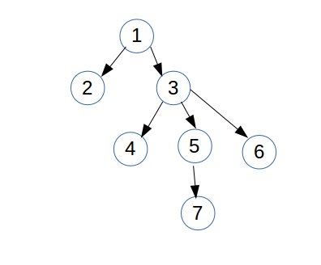

#How to use server-core module

Server's services represent a tree structure. To run it in sequence we must add services in **ServiceTree** collection.
In this collection there are some rules:
* all services are **Threads**
* services implement **IService** interface
* services add in **ServiceTree** collection from the top to the bottom.

For example:
If server's service structure is:


We mast to add initially first servise with **null** parent:

```java
services.addService(FirstService,null);
```

The next step to add second layer of services:
```java
services.addService(SecondService,FirstService);
services.addService(ThirdService,FirstService);
```
and so on.

After adding services we must start server:
```java
services.startServer();
```
After starting server we mast start monitoring.
```java
services.monitoring();
```

If one or more services go into inconsistentname condition all serviceTree was stopped.